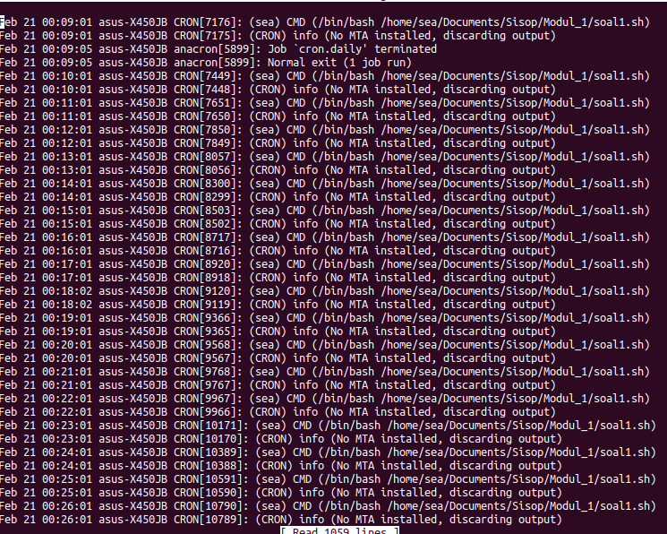

# Laporan Modul 1

### Soal 1
1. Anda diminta tolong oleh teman anda untuk mengembalikan filenya yang telah dienkripsi oleh seseorang menggunakan bash script, file yang dimaksud adalah nature.zip. Karena terlalu mudah kalian memberikan syarat akan membuka seluruh file tersebut jika pukul 14:14 pada tanggal 14 Februari atau hari tersebut adalah hari jumat pada bulan Februari.
Hint: Base64, Hexdump

      ```shell
      #!/bin/bash

      i="1"
      for var in /home/sea/Documents/Sisop/Modul_1/nature/*.jpg
      do 
       base64 -d $var | xxd -r > /home/sea/Documents/Sisop/Modul_1/nature_republic/$i.jpg
       i=$(($i + 1))
      done

      ```

      cron :

      

      Menggunakan base64 dan hexdump (xxd). Variabel i adalah nama file. Untuk tiap file di folder /home/sea/Documents/Sisop/Modul_1/nature*.jpg akan dilakukan dicode dengan base64, lalu dikembalikan lagi agar bisa dibuka lagi dengan menggunakan hexdump (xxd). 
      * base64 -d : decode
      * xxd -r : revert, mengembalikan agar file bisa terbaca
     
      

      

### Soal 2

2. Anda merupakan pegawai magang pada sebuah perusahaan retail, dan anda diminta untuk memberikan laporan berdasarkan file WA_Sales_Products_2012-14.csv.
Laporan yang diminta berupa:
   * Tentukan negara dengan penjualan(quantity) terbanyak pada tahun 2012.
   * Tentukan tiga product line yang memberikan penjualan(quantity)
terbanyak pada soal poin a.
   * Tentukan tiga product yang memberikan penjualan(quantity)
terbanyak berdasarkan tiga product line yang didapatkan pada soal
poin b.
   
      * Untuk poin a, dengan menggunakan awk -F untuk menggunakan , sebagai separator. Lalu memfilter data pada tahun 2012 dengan membandingkan kolom ke 7 ($7) dengan 2012. Untuk tiap negara di kolom pertama ($1) Quantity di kolom ke sepuluh ($10) dijumlahkan. Lalu print jumlah (i[x]) dengan state (x). Lalu hasil diletakkan di variabel result.

      * Untuk poin b, filter tahun sama dengan poin a, hanya ditambahkan filter state ($1) sesuai dengan hasil dari poin a. Untuk setiap Products Line ($4) dijumlahkan Quantitynya. Print jumlah (i[x]) dan product linenya. Hasil disimpan di array dibantu dengan IFS agar bisa disimpan per baris. Print array ke 0,1, dan 2.

      * Untuk poin c, sama seperti poin a dan b hanya saja ditambahkan filter Products Line ($4) sesuai dengan tiap array di poin b. Lalu di sort dan diambil 3 teratas.

      Source code lengkap a,b,c :
      
      ```shell
      #!/bin/bash

      echo "a"
      printf "\n"
      result=`awk -F ',' '{if ($7 == 2012) {i[$1]+=$10;}} END  {for (x in i) print i[x] "," x}' WA_Sales_Products_2012-14.csv | sort -nr | head -1 | awk -F ',' '{print $2}'`
      echo "$result"
      printf "\n"
      #--------------------------------------------

      echo "b"
      printf "\n"
      #oldIFS=$IFS
      IFS=$'\n'

      arr=( $( awk -F ',' '{if ($7 == 2012 && $1 = $result ) {i[$4]+=$10;}} END {for (x in i) print i[x] "," x;}' WA_Sales_Products_2012-14.csv | sort -nr | head -3 | awk -F ',' '{print $2}' ) )
      #IFS=$oldIFS

      a="${arr[0]}"
      b="${arr[1]}"
      c="${arr[2]}"

      echo "$a"
      echo "$b"
      echo "$c"
      printf "\n"
      #--------------------------------------------

      echo "c"
      printf "\n"
      awk -F ',' '{if ($1 == "United States" && $7 == 2012 && ($4 == "Personal Accessories" || $4 == "Camping Equipment" || $4 == "Outdoor Protection" )) {i[$6]+=$10;}} END {for (x in i) print i[x] "," x;}' WA_Sales_Products_2012-14.csv | sort -nr | head -3 | awk -F ',' '{print $2}'
      printf "\n"

      #----------------------------------
      
      ```
>>>>>>> 2dc79c3e7f4b970998c0dfb5d59fcb0d1c07a200
      
      Output dari ketiga poin :
   
      


## Soal 3

3. Buatlah sebuah script bash yang dapat menghasilkan password secara acak sebanyak 12 karakter yang terdapat huruf besar, huruf kecil, dan angka. Password acak tersebut disimpan pada file berekstensi .txt dengan ketentuan pemberian nama sebagai berikut:
   * Jika tidak ditemukan file password1.txt maka password acak tersebut disimpan pada file bernama password1.txt
   * Jika file password1.txt sudah ada maka password acak baru akan disimpan pada file bernama password2.txt dan begitu seterusnya.
   * Urutan nama file tidak boleh ada yang terlewatkan meski filenya dihapus.
   * Password yang dihasilkan tidak boleh sama.

      ```shell
      #!/bin/bash

      count=1

      while test -e "password$count.txt"; 
      do
              i=$(( $i + 1 ))
              count="$( printf -- '%d' "$i" )"
      done

      cat /dev/urandom | tr -dc 'a-zA-Z0-9' | fold -w 12 | head -n 1 > password$count.txt
      ```

      Jika file password$count.txt tidak ada maka akan melakukan increment i dan i akan di print di count. **cat /dev/urandom** berfungsi untuk melihat char random. **tr -dc 'a-zA-Z0-9'** berfungsi untuk membuat char dari alphabet kecil dan besar serta angka. **Fold -w** untuk membuat width atau lebar dari string. **Head -n** untuk mengambil baris pertama. lalu dimasukkan ke file **password$count.txt**
      
      

## Soal 4

## Soal 5

5. Buatlah sebuah script bash untuk menyimpan record dalam syslog yang memenuhi kriteria berikut:
   * Tidak mengandung string “sudo”, tetapi mengandung string “cron”,serta buatlah pencarian stringnya tidak bersifat case sensitive, sehingga huruf kapital atau tidak, tidak menjadi masalah.
   * Jumlah field (number of field) pada baris tersebut berjumlah kurang dari 13.
   * Masukkan record tadi ke dalam file logs yang berada pada direktori **/home/[user]/modul1.**
   * Jalankan script tadi setiap 6 menit dari menit ke 2 hingga 30, contoh 13:02, 13:08, 13:14, dst.
   
       ```shell
       awk '/cron/ || /CRON/,!/sudo/' /var/log/syslog | awk 'NF < 13' >> /home/sea/Documents/Sisop/Modul_1/soal5.log
       ```

        cron :

        

        **awk '/cron/ || /CRON/,!/sudo/'** berfungsi untuk menyaring yang hanya memiliki kata cron dan tidak mengandung kata CRON dan sudo dari /var/log/syslog. **awk 'NF < 13'** berfungsi untuk menampilkan kolom kurang dari 13 kolom. lalu disimpan di **/home/sea/modul1/soal5.log**
         Output :

        


